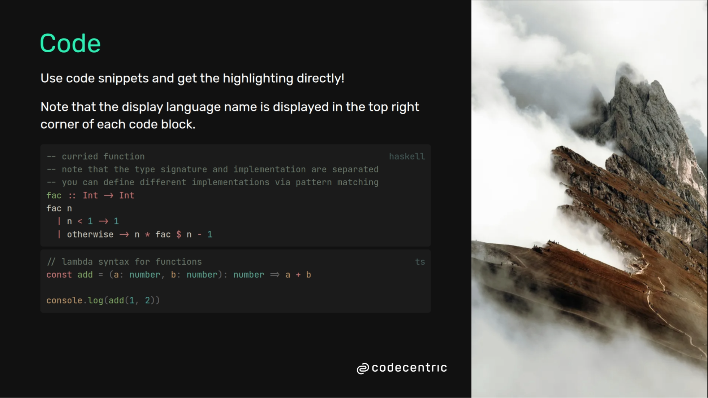

# slidev-theme-enolive

Personal highly opinionated theme for [Slidev](https://github.com/slidevjs/slidev).

Use it at your own risk. I might change everything without a further notice.
But feel free to fork the repo to use it for your own experiments!

**Disclaimer**: this is in no way an official slide theme of my employer. I also don't own
the company logo included in the assets. It is just my appreciation for working at such a great
place!

## Install

Add the following frontmatter to your `slides.md`. Start Slidev then it will prompt you to install the theme
automatically.

<pre><code>---
theme: <b>enolive</b>
---</code></pre>

Learn more about [how to use a theme](https://sli.dev/guide/theme-addon#use-theme).

## Layouts

This theme provides the following layouts:

- **fancy-intro**: just like intro, but with a cool image background on the right that can be handled with the image
  prop
- **intro**
- **fact**
- **cover**

## Components

This theme provides the following components:

- **qr-code**: allows you to generate a qr-code, for example to a website or your social media profile on the fly
- **v-card**: lists your GitHub/GitLab urls in the top right corner
- **word-cloud**: a simple word cloud

## Contributing

- `npm install`
- `npm run dev` to start theme preview of `example.md`
- Edit the `example.md` and style to see the changes
- `npm run export` to generate the preview PDF
- `npm run screenshot` to generate the preview PNG
